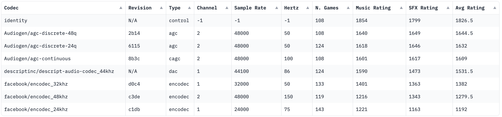

# Audiogen Codec (agc)

We are announcing the open source release of Audiogen Codec (agc) 🎉. A low compression 48khz stereo neural audio codec for general audio, optimizing for audio fidelity 🎵.

It comes in two flavors:

- agc-continuous 🔄
KL regularized, 32 channels, 100hz.
- agc-discrete 🔢
24 stages of residual vector quantization, 50hz.

AGC (Audiogen Codec) is a convolutional autoencoder based on the DAC architecture, which holds SOTA 🏆. We found that training with EMA and adding a perceptual loss term with CLAP features improved performance. These codecs, being low compression, outperform Meta's EnCodec and DAC on general audio as validated from internal blind ELO games 🎲.

We trained (relatively) very low compression codecs in the pursuit of solving a core issue regarding general music and audio generation, low acoustic quality and audible artifacts, which hinder industry use for these models 🚫🎶. Our hope is to encourage researchers to build hierarchical generative audio models that can efficiently use high sequence length representations without sacrificing semantic abilities 🧠.


This codec will power Audiogen's upcoming models. Stay tuned! 🚀



# Installation
```sh
pip install audiogen-agc
```

# Usage
```python
from agc import AGC

agc = AGC.from_pretrained("Audiogen/agc-continuous") # or "agc-discrete"

audio = torch.randn(1, 2, 480000) # 48khz stereo

z = agc.encode(audio) # (1, 32, 6000) or (1, 24, 3000)

reconstructed_audio = agc.decode(z) # (1, 2, 480000)
```

# Misc

Example colab: https://colab.research.google.com/drive/1MXeBYMY-dZ3Yas-5rXzggMONIlDDQ5VG#scrollTo=9mtfSc-r4dkn (credit: Christoph from LAION)

# Examples

https://audiogen.notion.site/Audiogen-Codec-Examples-546fe64596f54e20be61deae1c674f20
